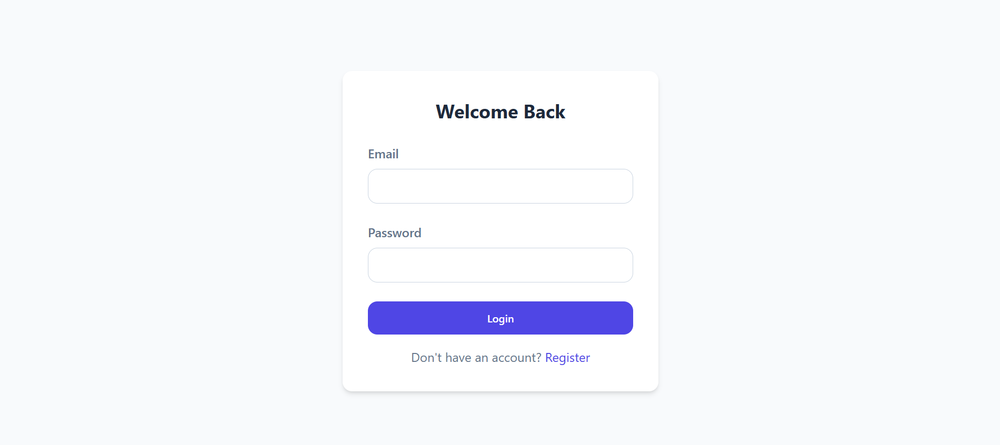
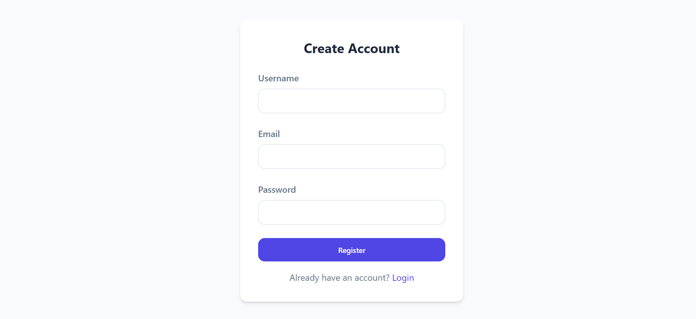
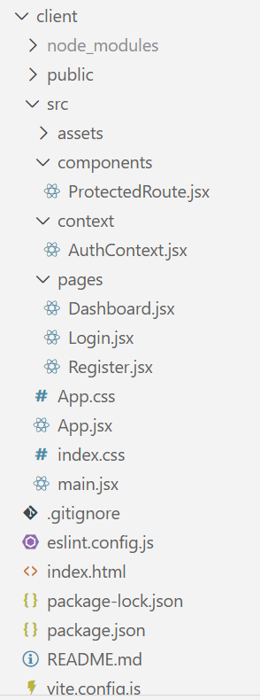
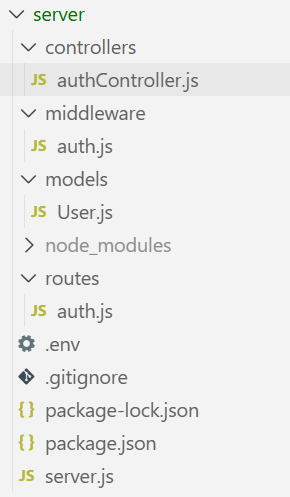

# WandarOn  Assignment: Secure User Authentication System 

The goal of this assignment is to demonstrate how modern applications should handle **user registration, login, JWT-based authentication, and security hardening** against common web vulnerabilities.

---
## FRONTEND VIEW :




## 🚀 Tech Stack

### Frontend

* **Vite + React**
* **Vanilla CSS**

### Backend

* **Node.js + Express**
* **MongoDB**

---

## Security Features

This assignment is built with security in mind from day one:

* Password hashing using **bcrypt**
* JWT authentication stored in **HTTP-only cookies** (non-sticky sessions)
* Protection against:

  * XSS attacks (`xss-clean`)
  * NoSQL Injection (`express-mongo-sanitize`)
* Secure HTTP headers via **Helmet**
* Environment variable management using **dotenv**
* Cookie parsing with **cookie-parser**

---

## Project Structure

### 1. CLIENT PROJECT STRUCTURE

### 2. SERVER PROJECT STRUCTURE


## Setup Instructions

### Clone the Repository

```bash
git clone <your-repo-url>
cd wanderon-auth
```

---

### Backend Setup

Navigate to the server folder:

```bash
cd server
npm install
```

Create a `.env` file:

** YOU CAN ADD YOUR OWN ENV JUST LIKE BELOW BUT I PUSHED THE ENV WITH ATLAS: WHICH IS OFCOURSE NEVER A GOOD PRACTICE BUT AS THIS IS THE ASSIGNMENT, SO FOR EASE OF EVALUATION I AM PUSHING IT ON MAIN BRANCH **

```env
PORT=5000
MONGO_URI=mongodb://localhost:27017/wanderon_auth
JWT_SECRET=your_super_secret_key
NODE_ENV=development
```

Start the backend server:

```bash
npm run dev
```

---

### Frontend Setup

Navigate to the client folder:

```bash
cd client
npm install
npm run dev
```

The frontend will start on a Vite development server.

---

## Authentication Flow

### Registration

* User submits username, email, and password
* Password is hashed before saving to MongoDB
* Plain text passwords are **never stored**

### Login

* Credentials are validated
* JWT is generated on success
* Token is stored in an **HTTP-only cookie**

### Protected Routes

* JWT is verified from cookies
* Unauthorized users are blocked
* Logged-in users can access protected pages (like Dashboard)

### Logout

* Auth cookie is cleared
* User session ends securely

---

## Manual Verification Checklist

You can verify everything:

* Register a new user
* Check MongoDB to confirm password is hashed
* Login and verify HttpOnly cookie is set
* Try accessing `/dashboard` without login (should fail)
* Login and retry (should succeed)
